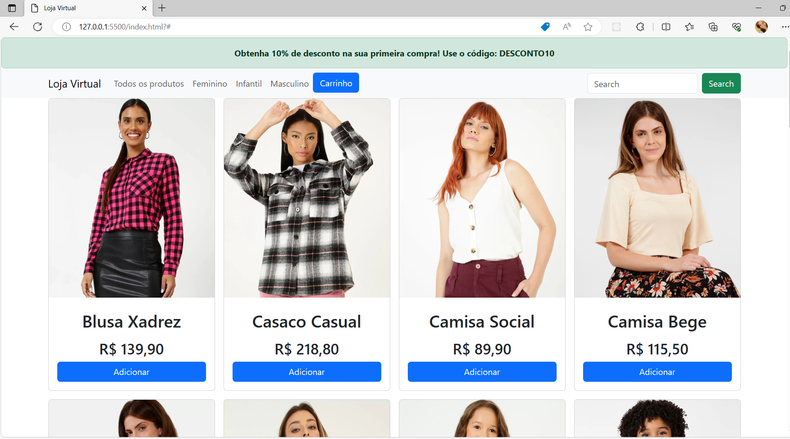

# Carrinho de Compras (Desafio Fast Track)

Bem-vindo ao projeto do Carrinho de Compras!

## Exemplo visual do projeto


Assista a uma breve demonstração do projeto no vídeo abaixo:

[!(https://drive.google.com/file/d/1Px7WOwf80Byk9IfKzr5VH7TyEgtFI5ze/view?usp=sharing)]


## Descrição

Este projeto foi desenvolvido durante o curso Fullstack chamado "Todas Tech" da empresa Imã. O objetivo do projeto foi criar um carrinho de compras que permite aos usuários selecionar produtos de três segmentos diferentes: feminino, infantil e masculino. Os produtos são exibidos de acordo com a categoria selecionada no menu superior.


### Funcionalidades Principais

- Filtragem por Segmento: Os usuários podem filtrar os produtos por segmento usando o menu superior. Os segmentos disponíveis são: feminino, infantil e masculino.

- Modal do Carrinho: Ao clicar no botão "Carrinho" no menu superior, um modal é exibido mostrando os produtos selecionados e suas respectivas quantidades. Os usuários podem adicionar, remover ou ajustar a quantidade de cada item no carrinho.

- Campo de Busca: O projeto possui um campo de busca que permite aos usuários procurar produtos pelo termo desejado. Por exemplo, ao pesquisar o termo "xadrez", todos os produtos que contenham essa palavra serão exibidos, independentemente do segmento.

### Teste para Fast Track

Este projeto também foi utilizado como um teste para seleção de participantes do programa "Fast Track". O "Fast Track" é uma turma avançada que acelera o aprendizado dos conteúdos abordados no curso "Todas Tech".

### Benefícios

- Experiência Prática: O projeto oferece aos participantes a oportunidade de colocar em prática os conhecimentos adquiridos durante o curso, trabalhando em um projeto real com foco no desenvolvimento web.

- Aprendizado Colaborativo: Durante o desenvolvimento do projeto, os participantes têm a chance de trabalhar em equipe, compartilhar conhecimentos e aprender uns com os outros.

- Portfólio Pessoal: Os participantes podem incluir o projeto em seus portfólios pessoais para demonstrar suas habilidades e experiência aos futuros empregadores ou clientes.

Esperamos que este projeto proporcione uma experiência enriquecedora e contribua para o crescimento profissional dos participantes.```

## Recursos e Tecnologias Utilizadas

O projeto do carrinho de compras foi desenvolvido utilizando as seguintes tecnologias e recursos:

### Tecnologias Principais

- HTML5: Utilizado para estruturar a página e criar a interface do projeto.

- CSS3: Responsável pela estilização e layout dos elementos na página.

- JavaScript: Linguagem de programação utilizada para implementar a lógica de interatividade e funcionalidades do carrinho de compras.

- Bootstrap: Framework de front-end que facilita o desenvolvimento de layouts responsivos e componentes prontos para uso.

### Recursos e Ferramentas

- LocalStorage: Utilizado para armazenar os dados do carrinho de compras localmente no navegador do usuário.

- Git: Sistema de controle de versão utilizado para gerenciar o código-fonte do projeto e permitir o trabalho em equipe.

- GitHub: Plataforma de hospedagem de código-fonte que facilita a colaboração e compartilhamento do projeto.

- Imã API: API fornecida pela empresa Imã, utilizada para obter as informações dos produtos, como nome, preço e imagens.

### Outras Bibliotecas

- Bootstrap Icons: Conjunto de ícones utilizados para melhorar a aparência e usabilidade da interface.

- Font Awesome: Biblioteca de ícones utilizada para adicionar ícones gráficos ao projeto.

### Ferramentas de Desenvolvimento

- Visual Studio Code: Editor de código-fonte utilizado para desenvolver o projeto, oferecendo recursos avançados de edição e depuração.

- Navegadores: O projeto foi testado e é compatível com os navegadores mais recentes, como Google Chrome, Mozilla Firefox, Microsoft Edge, etc.

### Hospedagem

- O projeto não está hospedado em nenhum servidor de produção e foi desenvolvido para ser executado localmente no navegador do usuário.

As tecnologias e recursos acima foram escolhidos para tornar o projeto eficiente e proporcionar uma ótima experiência ao usuário.


## Autora
Este projeto foi executado por Luana Souza
### Redes Sociais

- [LinkedIn](https://www.linkedin.com/in/luana-souza-dev/)
- [GitHub](https://github.com/luanah-souzza)

## Como Executar o Projeto

### Pré-requisitos
- Node.js (v14.17.3 ou superior)
- npm (v6.14.13 ou superior)

### Instalação

1. Clone este repositório para a sua máquina local usando o seguinte comando: git clone https://github.com/seu-usuario/seu-projeto.git

2. Navegue para o diretório do projeto: cd seu-projeto

3. Instale as dependências do projeto: npm install


## Créditos das Imagens

As imagens utilizadas neste projeto foram fornecidas pela empresa "Imã". Acesse o site da Imã para obter mais informações sobre suas fotos e serviços: [https://alunos.imatech.io/projetos/todas-tech/desafio-fast-track](https://alunos.imatech.io/projetos/todas-tech/desafio-fast-track).

Todas as imagens estão sujeitas aos direitos autorais da empresa Imã e são utilizadas neste projeto com permissão.

Se você pretende usar essas imagens em seu próprio projeto, verifique a licença e os termos de uso aplicáveis antes de fazer qualquer uso adicional.

## Contribuição

Contribuições são bem-vindas! Sinta-se à vontade para enviar pull requests com melhorias, correções de bugs ou novas funcionalidades para este projeto.

## Licença

Este projeto está licenciado sob a [MIT License](LICENSE).

Aproveite esta oportunidade de aprender e desenvolver suas habilidades em desenvolvimento web. Divirta-se criando o seu próprio Clone do Tinder e explore as possibilidades de criação de interfaces atraentes e responsivas.
